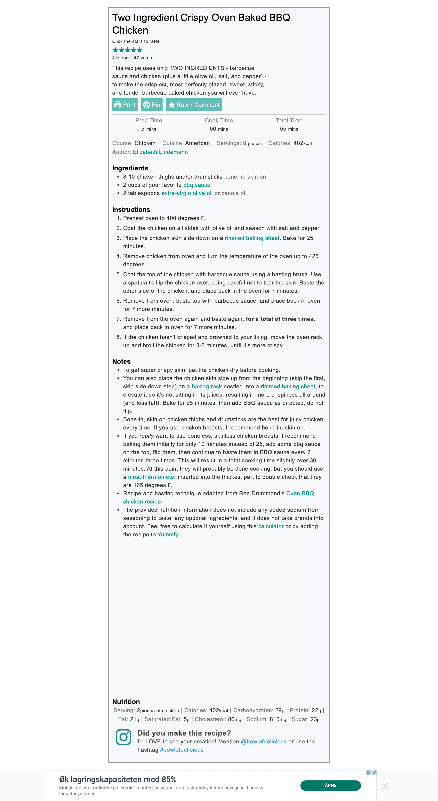

# recipe-ripper
Trying to fuzz out ingredients and instructions into a recipe database is a fools errand.

Here we take the Cut-Through-The-Noise-and-Give-Me-The-Recipe field's best and brightest, 
[Recipe Filter](https://chrome.google.com/webstore/detail/recipe-filter/ahlcdjbkdaegmljnnncfnhiioiadakae?hl=en), and use its
recipe-card-filtering premise to generate a 'focused' screenshot. 

mod.js can be used in conjunction with [capture-website-cli](https://github.com/sindresorhus/capture-website-cli)

A png of a recipe card is generated with `capture-website` with this command:

    capture-website https://www.bowlofdelicious.com/two-ingredient-crispy-oven-baked-bbq-chicken/ --full-page --output=img/bbq.png --overwrite --module=mod.js

## Raspberry Pi Notes:
Do NOT use chromium 78 for this. Puppeteer in capture-website-cli requires Chromium 80
https://www.raspberrypi.org/forums/viewtopic.php?p=1634156#p1634156
( get from here: https://packages.debian.org/buster/armhf/chromium/download )

Specify an executablePath in the puppeteer call inside of capture-website's dependencies
https://github.com/puppeteer/puppeteer/issues/550#issuecomment-551991273

    ~/.npm-global/lib/node_modules/capture-website-cli/node_modules/capture-website/index.js

